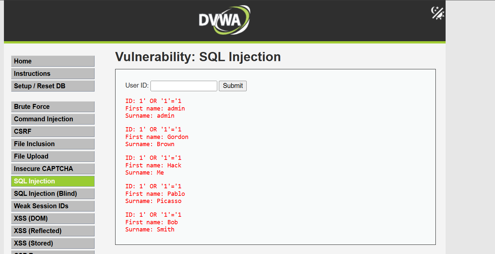
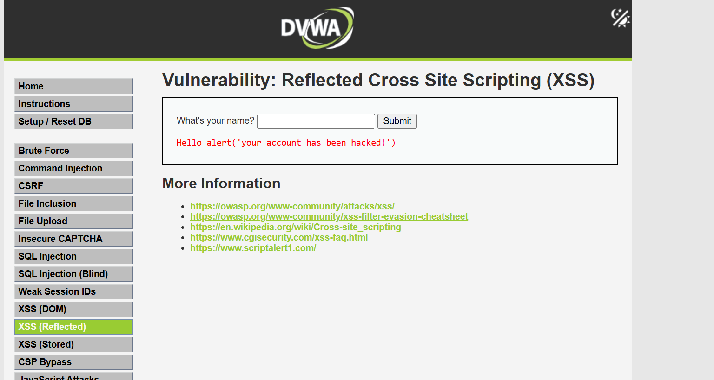
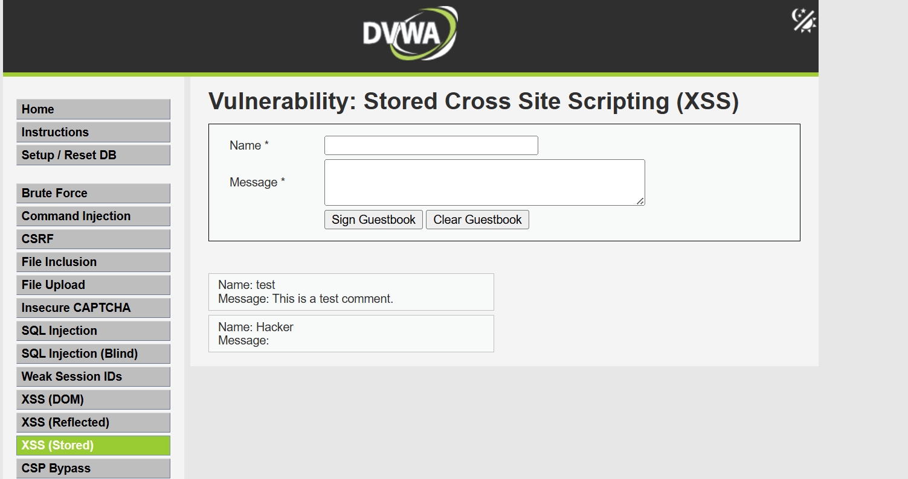

## DVWA Security Testing - Web Vulnerability Assessment

This project demonstrates practical testing and exploitation of common web application vulnerabilities using a controlled local environment (DVWA).

## Objective
To identify and exploit SQL Injection and Cross-Site Scripting (XSS) vulnerabilities, and analyze their security impact.

## Environment Setup
- Application: DVWA (Damn Vulnerable Web Application)
- Platform: Localhost (XAMPP)
- Security Level: Low

## SQL injection (SQLi)
## Payload Used
1' OR '1'='1

## Result

## Analysis
The payload alters the SQL query logic by injecting a condition that always evaluates to TRUE. This causes the application to return multiple records instead of a single user.

## Impact
- Unauthorized access to database records
- Exposure of sensitive information
- Authentication bypass

## Cross-Site Scripting (XSS)
# Reflected XSS
# Payload Used

## Result 

## Analysis
The payload is immediately reflected in the server response and executed in the browser, indicating that user input is not properly sanitized.

## Stored XSS
## payload Used
- Name Field: Hacker
- Message Field:

## Result

## Analysis
The payload is stored within the application and executed whenever the page is loaded. This demonstrates persistent XSS, where malicious scripts can affect multiple users over time.

## My Observation
Stored XSS is more dangerous than reflected XSS because it persists in the application and can impact all users who access the affected page.

## Prevention Technique 
- Use parameterized queries to prevent SQL Injection
- Validate and sanitize all user inputs
- Implement output encoding for dynamic content
- Apply Content Security Policy (CSP)
- Regularly test applications for vulnerabilities

## Conclusion
This project demonstrates how common web vulnerabilities can be exploited in a real environment. It highlights the importance of secure coding practices and proper input validation in preventing attacks.
